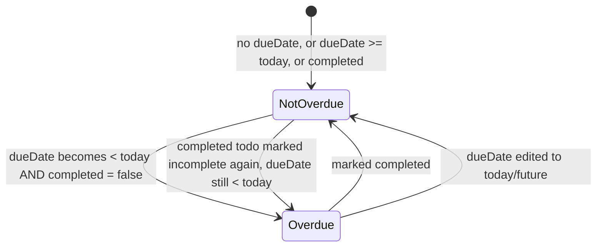

# Data Model: Support for Overdue Todo Items

This feature introduces **no new persisted fields, tables, or API payloads**. It adds one
derived (computed, never stored) UI concept on top of the existing `Todo` entity.

## Existing Entity: Todo (unchanged)

| Field | Type | Notes |
|---|---|---|
| `id` | number/string | Existing identifier, unchanged |
| `title` | string (≤255 chars) | Existing, unchanged |
| `dueDate` | date string \| `null` | Existing, optional, unchanged |
| `completed` | boolean (or `0`/`1`, matching current backend representation) | Existing, unchanged |
| `createdAt` | timestamp | Existing, unchanged (ordering) |

No fields are added, removed, or renamed. The backend API contract (request/response shapes
for create/read/update/delete) is unchanged by this feature.

## Derived Value: `isOverdue` (computed, not stored)

| Property | Value |
|---|---|
| **Type** | `boolean` |
| **Persisted?** | No — computed at render time on the frontend only |
| **Inputs** | `todo.dueDate`, `todo.completed`, current local date (`now`) |
| **Computation** | `!todo.completed && todo.dueDate != null && dateOnly(todo.dueDate) < dateOnly(now)` |
| **Recomputed when** | Todo list renders/refreshes (FR-008), a todo is toggled complete/incomplete (FR-006), a todo's due date is edited (FR-007), and on a periodic timer (>= once/minute) while the list stays open (FR-010) |

### State transitions (derived, not a stored state machine)

### Validation rules

- A todo with `dueDate === null` is **never** overdue (FR-003).
- A todo with `dueDate >= today` (calendar-date comparison) is **never** overdue (FR-004).
- A todo with `completed === true` is **never** overdue (FR-005).
- Only todos satisfying all three of: has a due date, due date `< today`, and `completed ===
  false`, are overdue (FR-001).

## Relationships

No new relationships. `isOverdue` is a pure function of a single existing `Todo` record plus
the current time; it does not reference or depend on any other entity.
